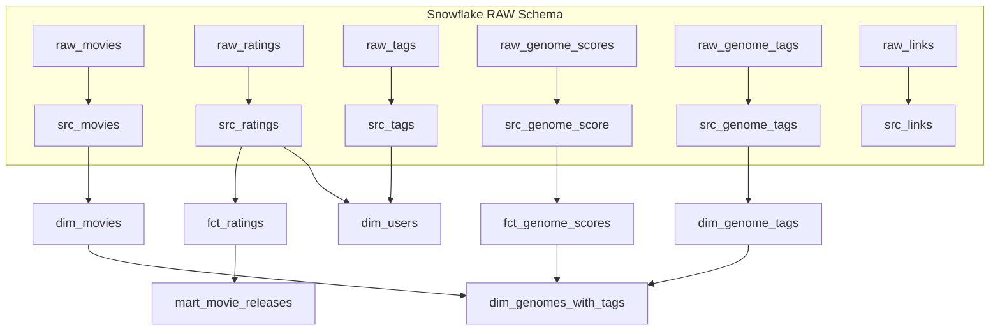

# 🎬 Netflix Data Engineering Project with dbt + Snowflake

[](https://docs.getdbt.com/)
[](https://www.snowflake.com/)
[](https://opensource.org/licenses/MIT)

## 📌 Overview
This project implements a **modern data stack** using **Snowflake** and **dbt** to model and analyze the [MovieLens dataset](https://grouplens.org/datasets/movielens/).  

It follows a **layered architecture**:
1. **Raw layer (staging in Snowflake)** → Data is ingested from CSV files stored in S3.
2. **Staging models (`src_*`)** → Standardize raw tables into consistent column names and formats.
3. **Dimension models (`dim_*`)** → Define descriptive entities like movies, users, and tags.
4. **Fact models (`fct_*`)** → Capture business events such as ratings and genome scores.
5. **Mart models (`mart_*`)** → Deliver analytics-ready datasets for BI and reporting.

---

## 🏗️ Project Structure
```
netflix/
├── models/
│   ├── staging/                # Cleaned sources from Snowflake RAW schema
│   │   ├── src_movies.sql
│   │   ├── src_ratings.sql
│   │   ├── src_tags.sql
│   │   ├── src_genome_score.sql
│   │   ├── src_genome_tags.sql
│   │   └── src_links.sql
│   │
│   ├── dim/                    # Dimension tables
│   │   ├── dim_movies.sql
│   │   ├── dim_users.sql
│   │   ├── dim_genome_tags.sql
│   │   └── dim_genomes_with_tags.sql
│   │
│   ├── fct/                    # Fact tables
│   │   ├── fct_ratings.sql
│   │   └── fct_genome_scores.sql
│   │
│   ├── mart/                   # Analytics-ready marts
│   │   └── mart_movie_releases.sql
│   │
│   └── sources.yml             # Source definitions for Snowflake RAW tables
│
├── seeds/                      # CSV seed files (e.g. movie release dates)
├── snapshots/                  # Historical tracking (if needed)
├── macros/                     # Custom dbt macros
├── tests/                      # Data quality tests
└── dbt_project.yml            # Project configuration
```

---

## ⚙️ Snowflake Setup

Run the following SQL script to prepare Snowflake:

```sql
-- Create role, warehouse, user, and database
USE ROLE ACCOUNTADMIN;

CREATE ROLE IF NOT EXISTS TRANSFORM;
GRANT ROLE TRANSFORM TO ROLE ACCOUNTADMIN;

CREATE WAREHOUSE IF NOT EXISTS COMPUTE_WH;

CREATE USER IF NOT EXISTS dbt
  PASSWORD='dbtPassword123'
  DEFAULT_ROLE=TRANSFORM
  DEFAULT_WAREHOUSE='COMPUTE_WH'
  DEFAULT_NAMESPACE='MOVIELENS.RAW';

GRANT ROLE TRANSFORM TO USER dbt;

CREATE DATABASE IF NOT EXISTS MOVIELENS;
CREATE SCHEMA IF NOT EXISTS MOVIELENS.RAW;

GRANT ALL ON DATABASE MOVIELENS TO ROLE TRANSFORM;
GRANT ALL ON SCHEMA MOVIELENS.RAW TO ROLE TRANSFORM;
```

Data is loaded from Amazon S3 into Snowflake tables using `COPY INTO` commands (see `scripts/` folder if included).

---

## 📊 Models Breakdown

### 🔹 Staging (models/staging/)
- **`src_movies.sql`** → Standardizes RAW_MOVIES.
- **`src_ratings.sql`** → Converts raw ratings with proper timestamps.
- **`src_tags.sql`** → Cleans user-generated tags.
- **`src_genome_score.sql`** → Extracts movie–tag relevance scores.
- **`src_genome_tags.sql`** → Standardizes genome tag labels.
- **`src_links.sql`** → Maps movie IDs to IMDB and TMDB.

### 🔹 Dimensions (models/dim/)
- **`dim_movies.sql`** → Clean movie titles, genres, and create genre_array.
- **`dim_users.sql`** → Consolidates unique users from ratings and tags.
- **`dim_genome_tags.sql`** → Human-readable tag names.
- **`dim_genomes_with_tags.sql`** → Combines movies, tags, and scores (ephemeral model).

### 🔹 Facts (models/fct/)
- **`fct_ratings.sql`** → Incremental model of user ratings with deduplication.
- **`fct_genome_scores.sql`** → Relevance scores between movies and tags.

### 🔹 Marts (models/mart/)
- **`mart_movie_releases.sql`** → Joins ratings with seeded release dates, flags whether release info is available.

---

## 📈 Data Flow



---

## ▶️ How to Run

### 1. Install dependencies:
```bash
pip install dbt-snowflake
```

### 2. Configure your `profiles.yml`:
```yaml
netflix:
  outputs:
    dev:
      type: snowflake
      account: <your_account>
      user: dbt
      password: dbtPassword123
      role: TRANSFORM
      warehouse: COMPUTE_WH
      database: MOVIELENS
      schema: DEV
      threads: 1
  target: dev
```

### 3. Run dbt commands:
```bash
dbt debug          # Test connection
dbt seed           # Load seed data (e.g. release dates)
dbt run            # Build models
dbt test           # Run data quality tests
```

---

## 🛠️ Additional dbt Features

### Seeds
**Seeds** are CSV files that contain static data loaded directly into your data warehouse. In this project, they're stored in the `seeds/` directory.

```bash
dbt seed           # Load all seed files
dbt seed --select movie_release_dates  # Load specific seed
```

Seeds are useful for:
- Reference data (e.g., movie release dates)
- Lookup tables
- Small dimensional data

### Views vs Tables in dbt
By default, dbt creates **views** in your data warehouse. You can control this behavior in your model files:

```sql
-- Create as a table
{{ config(materialized='table') }}
SELECT * FROM {{ ref('src_movies') }}

-- Create as a view (default)
{{ config(materialized='view') }}
SELECT * FROM {{ ref('src_movies') }}

-- Create as an incremental table
{{ config(materialized='incremental') }}
SELECT * FROM {{ ref('src_ratings') }}
```

**Views** are virtual tables that don't store data, while **tables** store actual data in your warehouse.

### Generate Documentation
dbt automatically generates documentation for your project:

```bash
dbt docs generate    # Generate documentation
dbt docs serve       # Serve documentation locally (localhost:8080)
```

The documentation includes:
- **Lineage graphs** showing data flow between models
- **Column descriptions** and data types
- **Test results** and freshness checks
- **Source definitions** and their relationships

### Model Materialization Types
- **`view`** → Virtual table (default)
- **`table`** → Physical table stored in warehouse
- **`incremental`** → Append/update only new records
- **`ephemeral`** → CTE that exists only during query compilation

---

## ✅ Key Features

- ✅ **Snowflake + dbt pipeline** with layered modeling
- ✅ **Incremental loads** for ratings (`fct_ratings`)
- ✅ **Ephemeral models** for performance (`dim_genomes_with_tags`)
- ✅ **Seeds support** for static reference data
- ✅ **Data quality tests** and documentation generation
- ✅ **Flexible materialization** (views, tables, incremental)

---

## 📚 References

- [dbt Documentation](https://docs.getdbt.com/)
- [Snowflake Docs](https://docs.snowflake.com/)
- [MovieLens Dataset](https://grouplens.org/datasets/movielens/)

---

## 👨‍💻 Author
**Gerardo Hernandez Widman**

[](https://linkedin.com/in/your-profile)
[](https://github.com/your-username)
